# Assal Kolhapuri Dryfruits – AWS DevOps Project

An end-to-end, production-style deployment of a Node.js e-commerce application on AWS, built to practice real-world **Infrastructure as Code, CI/CD automation, containerization, and cloud operations**.

This project takes a REST API from source code to a fully automated, secured, and monitored AWS deployment — provisioned entirely with Terraform and deployed via GitHub Actions.

## Architecture

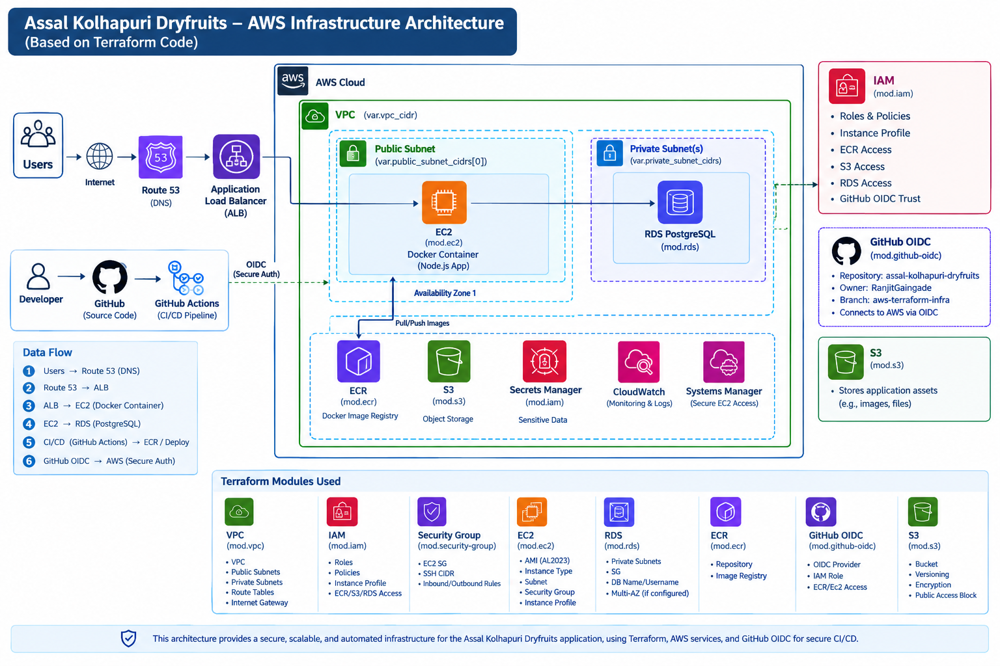

The application runs on AWS EC2 behind an Application Load Balancer, with a PostgreSQL database on RDS and Docker containers. The ALB handles routing and traffic distribution directly to the containerized application. Infrastructure is provisioned with Terraform, and deployments are automated end-to-end through GitHub Actions using OIDC-based secure authentication (no long-lived AWS credentials).

## Tech Stack

**Application:** Node.js, Express.js, PostgreSQL, Prisma
**Infrastructure:** AWS (EC2, VPC, RDS, ALB, Route 53, IAM, ECR, S3, Secrets Manager, CloudWatch, Systems Manager), Terraform
**Containers:** Docker
**CI/CD:** GitHub Actions, GitHub OIDC, Amazon ECR
**Security & Quality:** Trivy (vulnerability scanning), npm audit, ESLint
**Testing:** Jest, Supertest
**Monitoring:** AWS CloudWatch

## Key Features

- **Infrastructure as Code** — All AWS resources (VPC, subnets, EC2, RDS, IAM roles, security groups, ECR, S3) provisioned via reusable, version-controlled Terraform modules.
- **Secure CI/CD Pipeline** — GitHub Actions pipeline covering code validation, automated testing, Docker image builds, Trivy vulnerability scanning, image publishing, and automated EC2 deployment.
- **Zero long-lived AWS credentials** — GitHub authenticates to AWS via OIDC federation instead of stored access keys.
- **Zero SSH exposure** — deployments are pushed to EC2 using AWS Systems Manager (SSM), with no open SSH ports or long-lived key pairs required.
- **Git SHA-based image tagging** — every deployed container image is traceable back to the exact source commit.
- **Dependency vulnerability remediation** — identified and resolved a transitive `deepmerge-ts` vulnerability in the Prisma dependency tree using npm overrides, validated with `npm audit`.
- **Health checks & deployment verification** — automated PostgreSQL health checks and post-deployment verification steps built into the pipeline.
- **Load balancing & routing** — Route 53 and an Application Load Balancer handle DNS resolution and traffic distribution directly to the containerized application on EC2.
- **Observability** — CPU, memory, API request rates, latency, and container health, with AWS CloudWatch monitoring.

## CI/CD Pipeline Overview

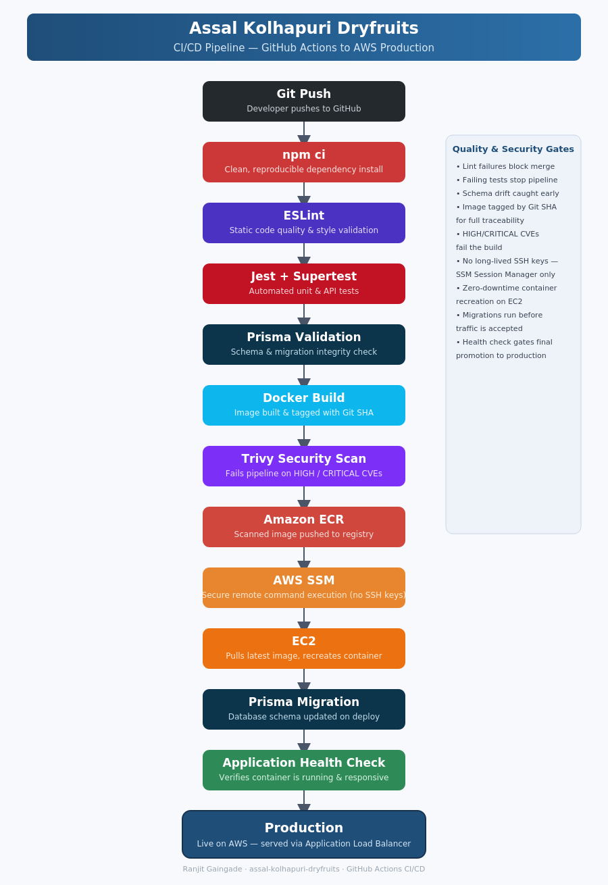

The pipeline runs automatically on every push, executing the following stages in order:

1. **Checkout source** — pulls the latest commit from GitHub.
2. **Setup Node.js** — configures the Node.js runtime for the build.
3. **Install dependencies** (`npm ci`) — clean, reproducible dependency install from `package-lock.json`.
4. **Lint** (ESLint) — static code quality and style validation.
5. **Test** (Jest + Supertest) — runs the full automated test suite.
6. **Validate Prisma schema** — verifies the database schema (`prisma/schema.prisma`) is valid before proceeding.
7. **Configure AWS credentials** — authenticates to AWS via GitHub OIDC (`aws-actions/configure-aws-credentials`), assuming a short-lived IAM role — no static AWS keys stored in GitHub.
8. **Login to Amazon ECR** — authenticates Docker to the private ECR registry.
9. **Build Docker image** — builds the production image and tags it with the Git commit SHA.
10. **Inspect production image dependencies** — reviews the final image's dependency tree before scanning.
11. **Scan Docker image with Trivy** — scans the built image for vulnerabilities; the pipeline fails on unresolved HIGH/CRITICAL findings.
12. **Push Docker image** — pushes the scanned, tagged image to Amazon ECR.
13. **Deploy to EC2 via SSM** — sends the deployment command to the target EC2 instance through AWS Systems Manager (no SSH access required), which pulls the new image and recreates the running container.
14. **Deployment verification** — confirms the container started successfully and the application is healthy.

### Pipeline environment (per run)
Each deployment run resolves environment-specific values dynamically, including:
- AWS region and ECR repository
- The Git SHA-based image tag
- Target EC2 instance ID
- RDS endpoint, database name, and Secrets Manager ARN for credentials

No credentials or secrets are hardcoded — they're injected at runtime via GitHub Actions secrets and AWS Secrets Manager.

### Pipeline Execution (Live Run)

**Install dependencies** (`npm ci`)
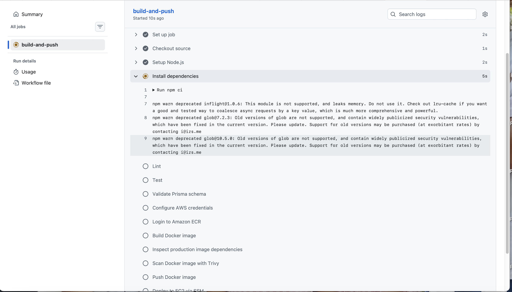

**Configure AWS credentials (OIDC) & Login to Amazon ECR**
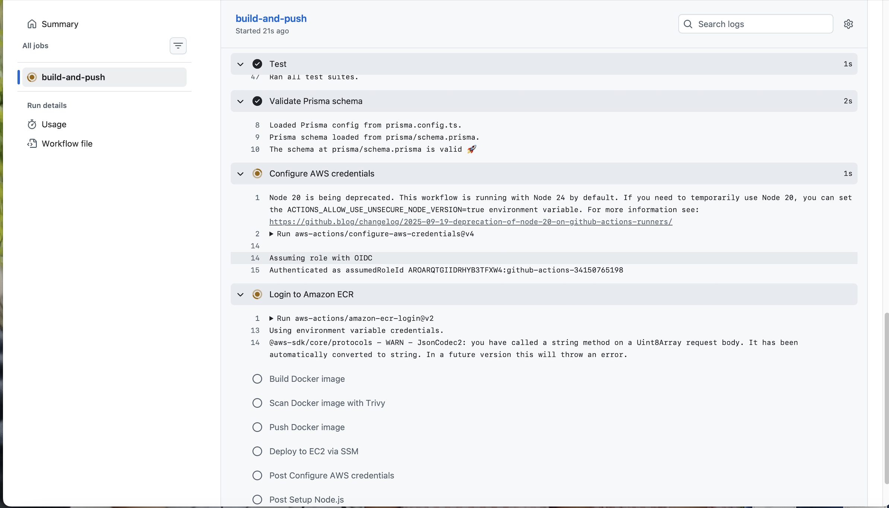

**Build Docker image**
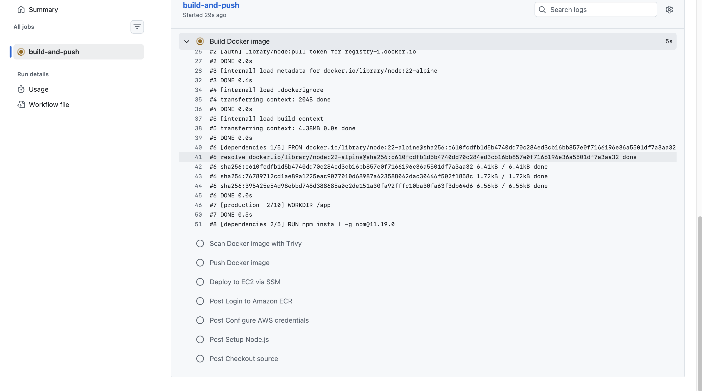

**Scan Docker image with Trivy**
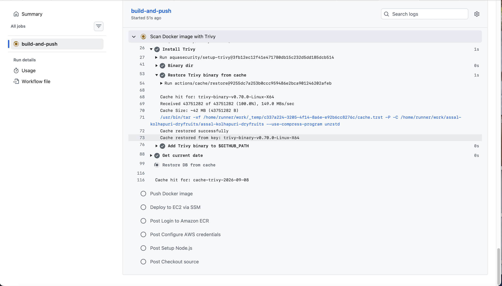

**Push Docker image to Amazon ECR**
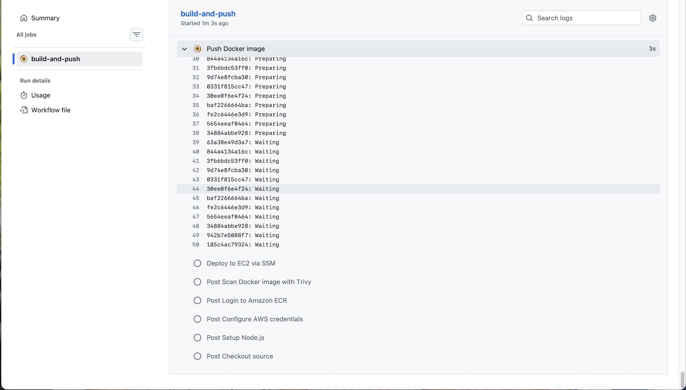

**Deploy to EC2 via AWS SSM**
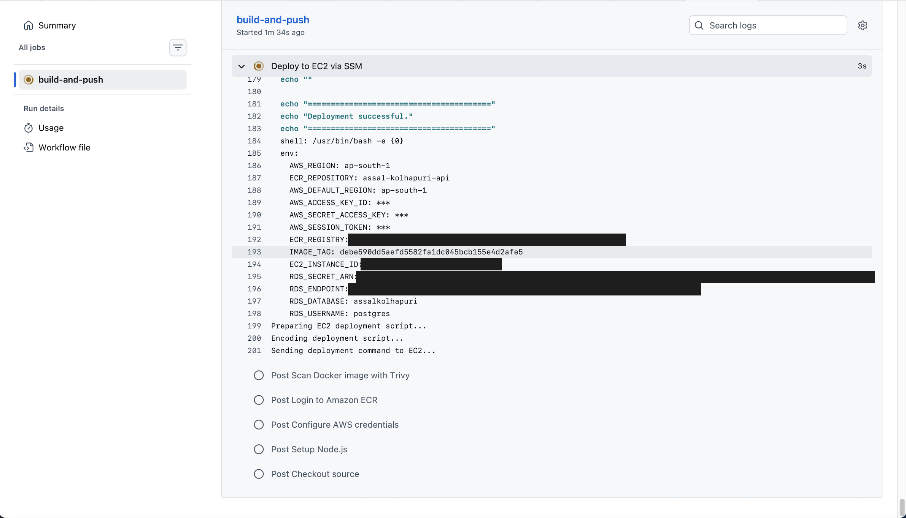

## Frontend Preview

**Homepage**
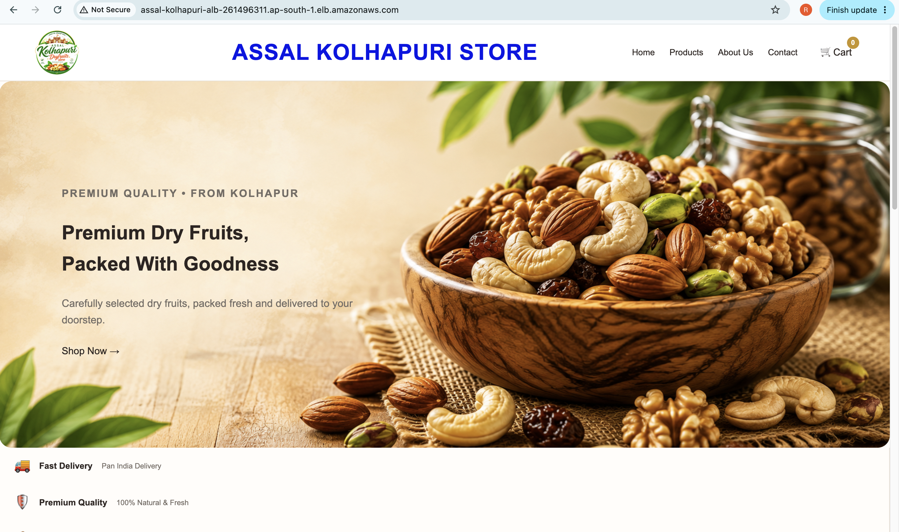

**Products**
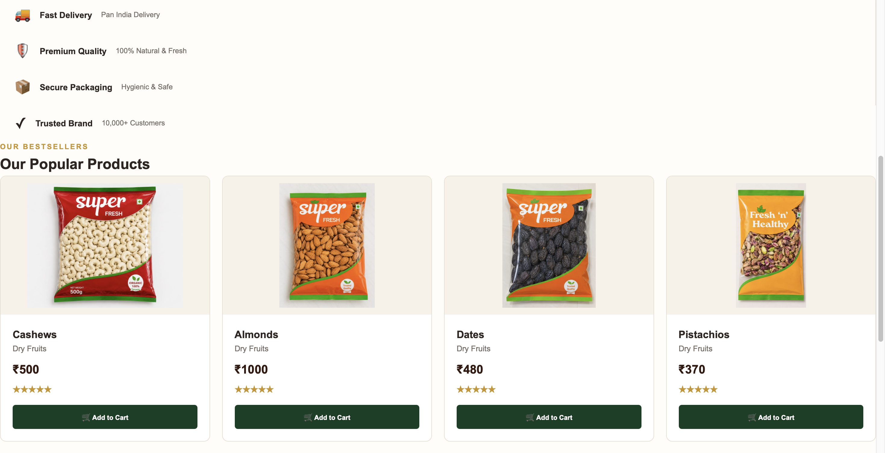

**Cart & Checkout**
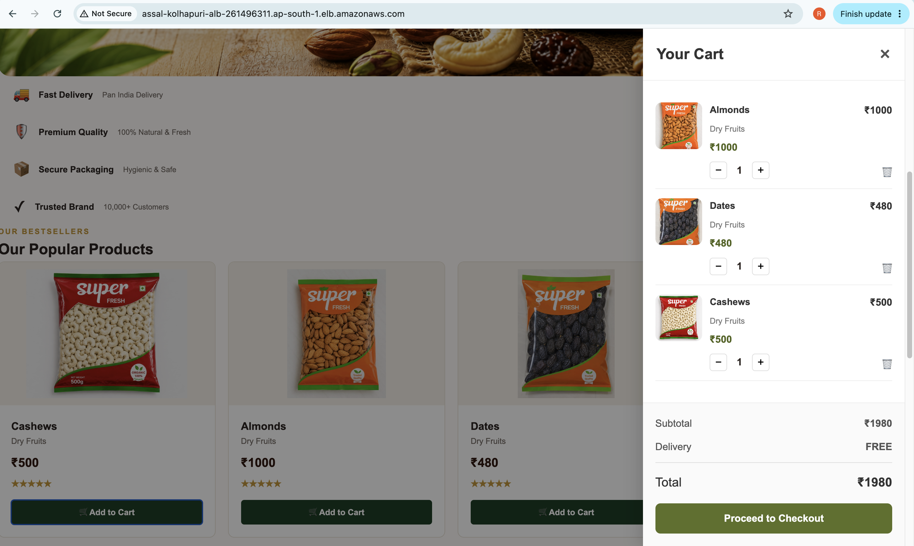

## Project Structure

```
├── .github/workflows/     # GitHub Actions CI/CD pipeline definitions
├── docs/                  # Architecture diagrams and documentation
├── terraform/             # Infrastructure as Code (VPC, EC2, RDS, ALB, IAM, S3, Route 53)
├── prisma/                # Database schema and migrations
├── public/                # Static application assets
├── tests/                 # Automated test suites
├── certs/                 # AWS RDS public root CA bundle (for SSL DB connections)
├── .dockerignore
├── .gitignore
└── README.md
```

## Author

**Ranjit Gaingade**
AWS Cloud / DevOps Engineer
[ranjitvidhyarthi@gmail.com](mailto:ranjitvidhyarthi@gmail.com)
